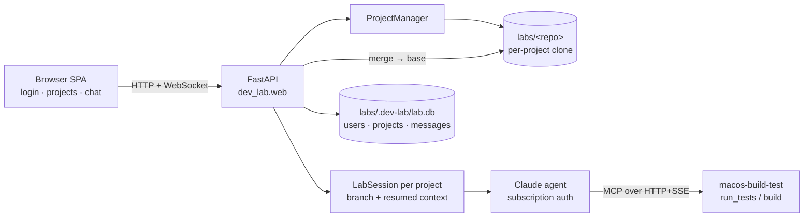

# Handoff — claude-agent-team

Status doc for the next agent. Last updated 2026-06-08.
For the durable plan see `project-plan.md`; for architecture see `CLAUDE.md` +
`cards/`. This file is the quick "where are we, what's left" orientation.

## TL;DR

An always-on Claude Agent SDK "dev lab". Two surfaces:
- **v2 web console (primary):** `dev-lab web` — a FastAPI app with login
  (multi-user), a `labs/` directory of projects (each its own git clone + Claude
  agent/context), and a browser chat that renders markdown + mermaid. **Done and
  live-verified.**
- **CLI (older, single-project):** `serve` + `chat-client` over WebSocket, file
  queue, extension MCP build/test. M0–M4 done and live-verified.

**What's left:** TLS/reverse-proxy for the web console, real-Pi deployment, GitHub
push (see gaps). 60 tests pass (dev-lab 50, chat-client 6, extension 4), ruff clean.

Git: all work is merged into **`main`** (fast-forward; the `m0-skeleton` and
`v2-web-console` branches are now redundant and can be deleted). Nothing is
pushed to a remote yet.

## Architecture (as built)

Primary surface — the v2 web console:



Verified end to end: browser login → clone project → cookie-authed WebSocket chat
→ per-project agent → streamed tool/markdown/mermaid → commit → merge → base →
per-project persistence.

The older **CLI path** still works and is independent: `chat-client` → `dev-lab
serve` (WebSocket) → file queue → supervisor → agent → MCP → run history in
SQLite. See `cards/dev-lab.md`.

## Repo layout

```
dev-lab/                  # the autonomous lab (runs on the Pi) — Python, its own venv
  src/dev_lab/
    config.py       # load_config(): MODEL + EXTENSIONS; refuses to start if ANTHROPIC_API_KEY set (GitHub auth is per project, on the project row)
    workspace.py    # git wrapper: branch/inspect/commit/checkout, merge(base,branch) — NOTE: no push yet (see gaps)
    agent.py        # Claude Agent SDK loop; build_agent_options() wires extension MCP servers
    lab.py          # run_once(): clean-tree -> branch -> agent edits -> one commit
    queue.py        # FileQueue: pending/running/done/failed, atomic claim, crash recovery
    supervisor.py   # serve(): drain queue, fail-and-continue, publish events, record runs
    session.py      # LabSession: interactive chat — one branch, resumed agent context per turn
    projects.py     # v2: ProjectManager — discover/clone(name from URL,+_2)/open/merge_to_base, per-project session+lock
    auth.py         # v2: multi-user accounts (scrypt), session helpers
    web.py          # v2: FastAPI app — login, projects REST, /ws chat, static mount
    static/         # v2: vanilla web UI (index.html, app.js, style.css, vendor/{marked,purify,mermaid})
    db.py           # SQLite + migrations (1 runs, 2 projects/messages, 3 users)
    events.py       # in-process EventBus (pub/sub)
    server.py       # CLI WebSocket control surface: submit -> queue; message -> chat session
    __main__.py     # CLI: web | run | serve | submit
chat-client/              # CLI control surface client (older surface)
  src/chat_client/{client.py (format_event), __main__.py (chat|submit|listen)}
extensions/macos-build-test/   # first extension — Python, its own venv
  src/macos_build_test/{builder.py (run_in_checkout), server.py (FastMCP/SSE), __main__.py (serve)}
deploy/                   # dev-lab.service (systemd) + README.md (Pi provisioning)
cards/                    # Context Cards (architecture + domain + decision)
project-plan.md           # milestones, decisions, open questions
```

Versions: dev-lab 0.6.0, chat-client 0.2.0, macos-build-test 0.1.0.

## How to run / develop

```sh
make setup           # create a venv per component, install editable + dev deps
make test            # 60 tests (dev-lab 50, chat-client 6, extension 4)
make lint            # ruff
```

Primary surface — web console:

```sh
dev-lab web --labs-dir ~/labs --host 127.0.0.1 --port 8770
# open http://127.0.0.1:8770 → register → new/select project (paste a GitHub
# token for private repos) → chat
```

Older CLI surface (each from its component's `.venv/bin/`):

```sh
dev-lab run "<instruction>" --repo <clone>        # one-shot
dev-lab serve --repo <clone> [--queue D --db F --host H --port P --poll S]
dev-lab submit "<instruction>" [--queue D]
chat-client {chat|submit|listen} [--url ws://host:8765]
macos-build-test serve [--host H --port 8970]     # serves /sse
```

Auth/config env: `MODEL` (default `claude-opus-4-8`), `EXTENSIONS=name=url,...`.
GitHub auth is **per project** — each project carries its own token (entered in
the web console, stored on its `projects` row), so there is no `GITHUB_TOKEN`
env var. Claude auth is the **`claude` login** (subscription), not an env var.

## Verified vs not

- **Live-verified** (real credits/sockets): M1 (instruction→commit), M3
  (chat→streamed agent output→commit), M4 (agent autonomously calling the
  extension MCP tool — proven via `CallToolRequest` log + side-effect file +
  stdout token), and **interactive chat sessions** (two follow-up turns on one
  `chat/<ts>` branch with resumed memory — turn 2 recalled a number from turn 1's
  conversation that was never on disk), and the **v2 web console** (served
  frontend + register + clone a project + cookie-authed WebSocket chat → streamed
  tool/markdown/mermaid → commit → **merge → base** → per-project persistence).
- **Eyeballed via headless Chromium (Playwright):** login, sidebar/project list, a
  chat with rendered markdown + mermaid, and the clone busy-spinner — all look
  right (and caught + fixed a mermaid label bug doing it). Not yet opened in a
  real human browser.
- **Tested but not on real hardware:** M2 runs uninterrupted locally; **never
  run on an actual Raspberry Pi**.
- Live runs need: `claude` logged in, network, and spend subscription credits
  (~$0.10–0.40 each). Run them with the sandbox disabled.

## What's left

### Gaps in what looks done (read these first)
- **No remote push (local merge only).** The web console can now **merge a chat
  branch into the project's base branch locally** (`workspace.merge` →
  `ProjectManager.merge_to_base` → `POST /api/projects/{id}/merge`, "merge → base"
  button). But nothing is **pushed** to GitHub yet — a project's per-project
  token is used to *clone* (and could push) private repos. To complete repo-sync (push → extension
  clones the pushed commit), add a `workspace.push` and a push step after merge.
- **M2 not validated on a Pi.** Follow `deploy/README.md` on real hardware
  (install Claude Code CLI, `claude` login as the service user, systemd enable).
- **Web console has no TLS.** Auth (accounts + signed cookie) exists, but the
  cookie isn't `Secure` and there's no HTTPS. Only bind `0.0.0.0` behind a reverse
  proxy / Tailscale. No `deploy/` unit for `dev-lab web` yet, and open
  registration is unrestricted (add a signup gate to lock it down).

### M5 — hardening (the open questions concentrate here)
- **Web console:** TLS + `Secure` cookie, a systemd unit for `dev-lab web`,
  optional signup-token gate.
- **Auth on the CLI WebSocket control surface** (`dev-lab serve`) — still
  unauthenticated/loopback (the web console is the authenticated path).
- **Auth on the extension SSE endpoints** — same; currently open.
- **Reconnection** — chat client reconnect; lab↔extension MCP resilience.
- **Observability** — health endpoint, structured logs, expose the SQLite run
  history.
- **Multi-extension discovery** — currently static `EXTENSIONS` env; consider a
  registry.
- **Optional: SDK session-resume** (`resume`/`session_id`) so a single long task
  survives a mid-run crash (today a crashed job is requeued and re-run from
  scratch on a fresh branch).

### Housekeeping
- Delete the merged `m0-skeleton` / `v2-web-console` branches; set up a remote and push.

## Gotchas the next agent must know

1. **Never set `ANTHROPIC_API_KEY`/`ANTHROPIC_AUTH_TOKEN`** — they override
   subscription auth and the lab refuses to start. Auth = a one-time `claude`
   login; the service must run as that user (creds in `~/.claude`).
2. **`agent.py` must use the `claude_code` system-prompt preset with `append`** —
   a bare custom `system_prompt` string drops the engine's working-directory
   context and the agent writes files outside the clone. (Cost me a debugging
   round; verified fix is in.)
3. **SQLite migrations are append-only**, keyed on `PRAGMA user_version`
   (`db.py`, now #1 runs / #2 projects+messages / #3 users). Never edit/renumber a
   shipped migration — add a new one.
4. **Transports are decided:** WebSocket for chat/UI, HTTP+SSE for extension MCP
   (`cards/control-transports.md`).
5. **Per-component venvs** — don't add one shared venv. `make setup` per repo.
6. **Opus needs a Max plan**; subscription Agent SDK usage is personal-use only
   and draws from a separate monthly credit pool.
7. The **file queue is intentionally filesystem-based** (atomic-rename claim);
   durable *records/logs* go to SQLite. Don't "consolidate" them without reason.
8. **v2: each project is its own clone under `labs/`** with its own session/branch
   (`projects.py`). All lab state (db + cookie secret) lives under
   `<labs>/.dev-lab/`. `db.connect` uses `check_same_thread=False` because the web
   loop may run on a different thread than where the connection was created
   (access stays serialized through the single event loop).
9. **Web: agent output is untrusted** — it's rendered as markdown, so always keep
   `DOMPurify.sanitize` + mermaid `securityLevel:"strict"` in `static/app.js`.
   (Mermaid's own SVG is injected raw — strict mode sanitizes it; a DOMPurify pass
   over it mangles the diagram.)
10. **New UI buttons** that fire an async/slow action must use `withButton(...)` in
    `static/app.js` (double-tap guard + spinner). See `cards/no-double-submit.md`.

## Pointers

- `project-plan.md` — Goal / Non-goals / Milestones / Decisions / Open questions.
- `QUICKSTART.md` — run the web console and the CLI surface.
- `CLAUDE.md` — card index (trigger-phrase based); read a card when its trigger matches.
- `cards/` — `architecture`, `web-console`, `dev-lab`, `chat-client`,
  `extension-clients`, `repo-sync`, `deployment`, and decision cards
  (`subscription-auth`, `control-transports`, `sqlite-runtime-data`,
  `no-double-submit`, `mcp-for-extensions`, `claude-agent-sdk-self-hosted`,
  `python-venvs`).
