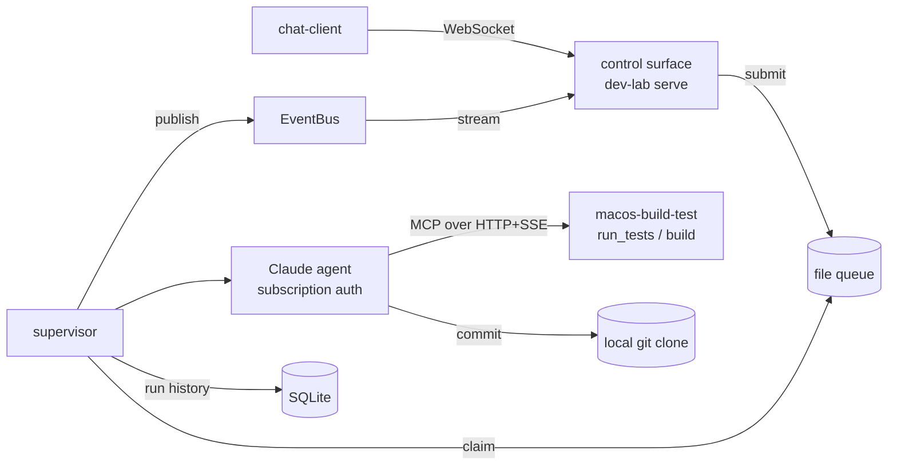

# Handoff — claude-agent-team

Status doc for the next agent. Last updated 2026-06-08.
For the durable plan see `project-plan.md`; for architecture see `CLAUDE.md` +
`cards/`. This file is the quick "where are we, what's left" orientation.

## TL;DR

An always-on Claude Agent SDK "dev lab" that runs autonomous dev work on a Pi,
steered by a chat client over WebSocket, with capabilities (build/test) borrowed
from extension clients exposed as MCP servers. **All five build milestones
(M0–M4) are implemented and live-verified; M5 (hardening) and real-Pi deployment
are what's left.** 41 tests pass, ruff clean.

Git: everything is on branch **`m0-skeleton`** (holds M0–M4), **not yet merged to
`main`**. Latest commit `77613cf`.

## Architecture (as built)



One path, verified end to end: chat → WebSocket → file queue → supervisor →
Claude agent → MCP tool call → extension runs it → result streams back → run
logged in SQLite.

## Repo layout

```
dev-lab/                  # the autonomous lab (runs on the Pi) — Python, its own venv
  src/dev_lab/
    config.py       # load_config(): GITHUB_TOKEN + EXTENSIONS; refuses to start if ANTHROPIC_API_KEY set
    workspace.py    # git wrapper (branch/inspect/commit) — NOTE: no push yet (see gaps)
    agent.py        # Claude Agent SDK loop; build_agent_options() wires extension MCP servers
    lab.py          # run_once(): clean-tree -> branch -> agent edits -> one commit
    queue.py        # FileQueue: pending/running/done/failed, atomic claim, crash recovery
    supervisor.py   # serve(): drain queue, fail-and-continue, publish events, record runs
    session.py      # LabSession: interactive chat — one branch, resumed agent context per turn
    db.py           # SQLite + append-only migration runner (PRAGMA user_version)
    events.py       # in-process EventBus (pub/sub)
    server.py       # WebSocket control surface: submit -> queue; message -> chat session
    __main__.py     # CLI: run | serve | submit
chat-client/              # control surface client
  src/chat_client/{client.py (format_event), __main__.py (chat|submit|listen)}
extensions/macos-build-test/   # first extension — Python, its own venv
  src/macos_build_test/{builder.py (run_in_checkout), server.py (FastMCP/SSE), __main__.py (serve)}
deploy/                   # dev-lab.service (systemd) + README.md (Pi provisioning)
cards/                    # Context Cards (architecture + domain + decision)
project-plan.md           # milestones, decisions, open questions
```

Versions: dev-lab 0.5.0, chat-client 0.2.0, macos-build-test 0.1.0.

## How to run / develop

```sh
make setup           # create a venv per component, install editable + dev deps
make test            # 46 tests (dev-lab 36, chat-client 6, extension 4)
make lint            # ruff
```

CLIs (each from its component's `.venv/bin/`):

```sh
dev-lab run "<instruction>" --repo <clone>        # one-shot
dev-lab serve --repo <clone> [--queue D --db F --host H --port P --poll S]
dev-lab submit "<instruction>" [--queue D]
chat-client submit "<instruction>" [--url ws://host:8765]
chat-client listen [--url ...]
macos-build-test serve [--host H --port 8970]     # serves /sse
```

Auth/config env: `GITHUB_TOKEN` (required), `MODEL` (default `claude-opus-4-8`),
`EXTENSIONS=name=url,...`. Claude auth is the **`claude` login** (subscription),
not an env var.

## Verified vs not

- **Live-verified** (real credits/sockets): M1 (instruction→commit), M3
  (chat→streamed agent output→commit), M4 (agent autonomously calling the
  extension MCP tool — proven via `CallToolRequest` log + side-effect file +
  stdout token), and **interactive chat sessions** (two follow-up turns on one
  `chat/<ts>` branch with resumed memory — turn 2 recalled a number from turn 1's
  conversation that was never on disk).
- **Tested but not on real hardware:** M2 runs uninterrupted locally; **never
  run on an actual Raspberry Pi**.
- Live runs need: `claude` logged in, network, and spend subscription credits
  (~$0.10–0.40 each). Run them with the sandbox disabled.

## What's left

### Gaps in what looks done (read these first)
- **No GitHub push.** `workspace` commits to the *local* clone only; the lab
  never pushes branches to GitHub. `GITHUB_TOKEN` is required by config but
  currently **unused** (reserved for this). The repo-sync design (lab pushes →
  extension clones from GitHub) is only half-wired: the extension can clone any
  repo URL/path, but the lab doesn't publish commits yet. Implement push in
  `workspace`/`lab` and use the token.
- **M2 not validated on a Pi.** Follow `deploy/README.md` on real hardware
  (install Claude Code CLI, `claude` login as the service user, systemd enable).

### M5 — hardening (the open questions concentrate here)
- **Auth on the WebSocket control surface** — currently unauthenticated and
  loopback-bound; add token/Tailscale/mTLS before exposing off-host.
- **Auth on the extension SSE endpoints** — same; currently open.
- **Reconnection** — chat client reconnect; lab↔extension MCP resilience.
- **Observability** — health endpoint, structured logs, expose the SQLite run
  history.
- **Multi-extension discovery** — currently static `EXTENSIONS` env; consider a
  registry.
- **Optional: SDK session-resume** (`resume`/`session_id`) so a single long task
  survives a mid-run crash (today a crashed job is requeued and re-run from
  scratch on a fresh branch).

### Housekeeping
- Merge `m0-skeleton` → `main` (branch name is stale — it carries M0–M4).

## Gotchas the next agent must know

1. **Never set `ANTHROPIC_API_KEY`/`ANTHROPIC_AUTH_TOKEN`** — they override
   subscription auth and the lab refuses to start. Auth = a one-time `claude`
   login; the service must run as that user (creds in `~/.claude`).
2. **`agent.py` must use the `claude_code` system-prompt preset with `append`** —
   a bare custom `system_prompt` string drops the engine's working-directory
   context and the agent writes files outside the clone. (Cost me a debugging
   round; verified fix is in.)
3. **SQLite migrations are append-only**, keyed on `PRAGMA user_version`
   (`db.py`). Never edit/renumber a shipped migration — add a new one. M3 chat
   logs should be migration #2 reusing `db.py`.
4. **Transports are decided:** WebSocket for chat/UI, HTTP+SSE for extension MCP
   (`cards/control-transports.md`).
5. **Per-component venvs** — don't add one shared venv. `make setup` per repo.
6. **Opus needs a Max plan**; subscription Agent SDK usage is personal-use only
   and draws from a separate monthly credit pool.
7. The **file queue is intentionally filesystem-based** (atomic-rename claim);
   durable *records/logs* go to SQLite. Don't "consolidate" them without reason.

## Pointers

- `project-plan.md` — Goal / Non-goals / Milestones / Decisions / Open questions.
- `CLAUDE.md` — card index (trigger-phrase based); read a card when its trigger matches.
- `cards/` — `architecture`, `dev-lab`, `chat-client`, `extension-clients`,
  `repo-sync`, `deployment`, and decision cards (`subscription-auth`,
  `control-transports`, `sqlite-runtime-data`, `mcp-for-extensions`,
  `claude-agent-sdk-self-hosted`, `python-venvs`).
