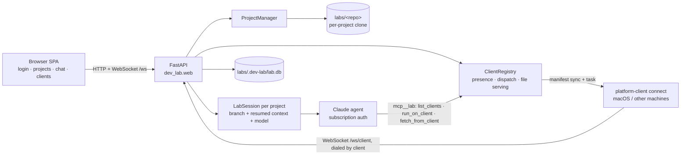

# Handoff — claude-agent-team

Status doc for the next agent. Last updated 2026-06-10.
For the durable plan see `project-plan.md`; for architecture see `CLAUDE.md` +
`cards/`. This file is the quick "where are we, what's left" orientation.

## TL;DR

An always-on Claude Agent SDK "dev lab". Three pieces:
- **v2 web console (primary):** `dev-lab web` — FastAPI app with login
  (multi-user), a `labs/` directory of projects (each its own git clone + Claude
  agent/context), browser chat with markdown + mermaid, repo actions
  (fetch/pull/push/reset/rebase-on-base/merge/browse/download-zip — rebase
  conflicts can be handed to the agent via chat), uploads (into the repo, or
  as chat attachments via `.lab-uploads/` for the agent to look at),
  **per-project model selection** (switchable mid-chat), and a
  connected-clients sidebar. Done and live-verified.
- **Platform clients (M6 v1, new):** capability providers on other machines
  that **dial in to the lab** over WebSocket, announce capabilities, and run
  commands in a manifest-synced mirror of a project's working tree. The agent
  drives them via `mcp__lab` tools. Live-verified on a single host.
- **CLI (older, single-project):** `serve` + `chat-client` over WebSocket, file
  queue. Still works, secondary.

**Deployed:** the web console runs on the real Pi (`homepi`) behind Apache at
**https://home.memention.net/dev-lab/** — systemd unit `dev-lab-web`, code at
`~/dev-lab/claude-agent-team/`, labs in `~/dev-lab/labs/`, TLS terminated by
Apache (`deploy/apache-dev-lab.conf`), `CLIENT_TOKEN` set in the Pi's
`dev-lab/.env`. The SPA is path-prefix aware (`BASE` in `static/app.js`).

**What's left:** cross-machine (Mac ↔ Pi) live verification, port
macos-build-test to the new model, M5 hardening (Secure cookie, WS auth,
observability). 164 tests pass (dev-lab 130, platform-client 26,
chat-client 6, macos-build-test 2), ruff clean.

Git: everything on **`main`**, pushed to
`github.com/epatel/claude-agent-team`.

## Architecture (as built)



The reversed connection (clients dial the lab) replaced the old MCP-over-SSE
`EXTENSIONS=name=url` model on 2026-06-10 — see `cards/extension-clients.md`
and the superseded-decision notes in the plan. Key properties: presence = the
registry; code reaches clients via **content-hash manifest sync** (uncommitted
working tree included, warm per-project mirror, strays deleted each run);
`run_on_client` takes `preserve` glob patterns to keep build artifacts between
runs; `fetch_from_client` pulls artifacts back into the lab's working tree
(they get committed with the session unless .gitignored). The web file browser
has **source tabs**: browse a connected client's mirror (artifacts included),
fetch a file back to the lab, or remove the mirror from the client — wire
frames `mirror`/`clean` next to `task`/`fetch` (see `dev_lab/clients.py`).

## Repo layout

```
dev-lab/                  # the lab (runs on the Pi) — Python, its own venv
  src/dev_lab/
    config.py       # Config + KNOWN_MODELS (selectable models; see cards/known-models.md) + CLIENT_TOKEN
    clients.py      # ClientRegistry: connected platform clients, task dispatch, fetch, file serving; wire protocol doc
    agent.py        # Agent SDK loop; _client_tools() = mcp__lab SDK toolset; claude_code preset + append
    projects.py     # ProjectManager: discover/clone/open/merge/push/pull, per-project model, set_model
    session.py      # LabSession: one branch + resumed context per project
    web.py          # FastAPI: login, projects REST, /api/models, /api/clients, /ws (console), /ws/client (platform clients)
    db.py           # SQLite migrations 1–7 (7 = projects.model)
    workspace.py / auth.py / events.py / static/ / queue.py / supervisor.py / lab.py / server.py
chat-client/              # CLI control surface (older surface)
extensions/
  platform-client/        # shared package: manifest.py (sync primitives), runtime.py (+ connect CLI), legacy workspace/cli
  macos-build-test/       # OLD MCP-over-SSE model — still works, to be ported (then likely deleted)
deploy/                   # dev-lab.service (systemd) + Pi provisioning README
cards/                    # Context Cards — index in CLAUDE.md
```

Versions: dev-lab 0.6.0, chat-client 0.2.0, platform-client 0.2.0.

## How to run / develop

```sh
make setup           # venv per component; also installs platform-client into dev-lab + macos venvs
make test            # 149 tests
make lint            # ruff
```

Web console + a platform client (the M6 loop):

```sh
# lab (optionally CLIENT_TOKEN=... to gate clients)
dev-lab web --labs-dir ~/labs --host 127.0.0.1 --port 8770

# on the capability machine (mirrors default to ~/.platform-client/mirrors)
platform-client connect --lab ws://<lab>:8770/ws/client --name mac \
  --capability run_tests --capability build [--token ...]

# then in a project chat: "run `make test` on client mac" — the agent uses
# mcp__lab list_clients / run_on_client / fetch_from_client
```

Auth: Claude = one-time `claude` login (subscription, **no API key ever** —
the lab refuses to start if one is set). GitHub = per project, entered in the
web console. `.env` holds optional overrides only (`MODEL`, `CLIENT_TOKEN`).

## Verified vs not

- **Live-verified** (real credits/sockets): M1/M3/M4 + interactive sessions +
  the v2 web console (all 2026-06-08, see git history), and **M6 v1 on a
  single host** (2026-06-10): real `dev-lab web` + real `platform-client
  connect` + one agent chat turn — the agent autonomously called
  `list_clients` → `run_on_client` (stdout + changed-files came back) →
  `fetch_from_client` (artifact landed in the lab tree, committed on the chat
  branch); wrong-token hello rejected (1008); registry emptied on client kill.
- **Automated end-to-end**: `dev-lab/tests/test_clients_live.py` runs the full
  protocol over a real uvicorn + websocket (sync, warm second run, preserve,
  fetch) on every `make test`.
- **Not yet:** cross-machine (Mac ↔ Pi) run; real Raspberry Pi hardware (M2
  verified locally only).
- Live agent runs need: `claude` logged in, network, subscription credits
  (~$0.10–0.40 each), sandbox disabled.

## What's left

### Next obvious moves
- **Cross-machine live verification**: lab on the Pi (or this Mac), client on
  the other machine; needs the Pi reachable (port-forward or Tailscale).
- **Port `macos-build-test`** to the new model — it's just
  `platform-client connect --capability ...` now; then delete the old
  FastMCP/SSE code (`workspace.run_in_checkout`, `extension_cli`, `EXTENSIONS`
  env + `agent.build_agent_options` SSE wiring).
- **Wrong-token UX** (verification finding): the client prints a raw
  traceback on auth rejection, and `connect_forever` retries forever against a
  wrong token (auth close should be terminal like `ProtocolError`).

### M5 — hardening
- TLS + `Secure` cookie + a systemd unit for `dev-lab web`; signup gate exists
  (invite codes) but cookie/transport security doesn't.
- Auth: console WS uses the session cookie; `/ws/client` has optional
  `CLIENT_TOKEN`; the old CLI `serve` socket is still unauthenticated/loopback.
- Observability: health endpoint, structured logs, surface run history.
- Manifest sync scale: whole-tree hash per task, 10MB per-file cap — fine for
  small repos; mtime cache / chunked transfer if trees grow.

## Gotchas the next agent must know

1. **Never set `ANTHROPIC_API_KEY`/`ANTHROPIC_AUTH_TOKEN`** — they override
   subscription auth; the lab refuses to start. Auth = one-time `claude` login.
2. **`agent.py` must use the `claude_code` system-prompt preset with `append`**
   — a bare custom `system_prompt` drops cwd context and the agent writes
   outside the clone.
3. **SQLite migrations are append-only** (now 1–7; 7 = `projects.model`).
   Never edit/renumber a shipped one.
4. **The client wire protocol is lab-owned** — documented in
   `dev_lab/clients.py`'s module docstring; `task_id` is a correlation id
   (fetches use it too). Both sides share `platform_client.manifest`; the
   Makefile installs platform-client into dev-lab's venv (pyproject can't
   express relative-path deps — keep the `make setup` lines).
5. **Mirror semantics**: sync deletes mirror files not in the source manifest
   (including previous run artifacts) unless `preserve` patterns say otherwise;
   `DEFAULT_IGNORES` (.git/.venv/__pycache__/…) are never synced *or* deleted.
   fnmatch `*` crosses `/`.
6. **Per-component venvs** — no shared venv; `make setup`.
7. **Opus needs a Max plan**; subscription SDK usage draws from a separate
   monthly credit pool, personal-use only.
8. **v2: each project is its own clone under `labs/`**; lab state in
   `<labs>/.dev-lab/`. Per-project model: NULL on the row = lab default;
   switching drops the cached session (conversation resumes, next turn uses the
   new model).
9. **Web: agent output is untrusted** — keep `DOMPurify.sanitize` + mermaid
   `securityLevel:"strict"` in `static/app.js`.
10. **New UI buttons** that fire async actions use `withButton(...)` (or the
    select-element variant) — `cards/no-double-submit.md`.
11. **Naming**: these components are **"platform clients"** now (settled
    2026-06-10); "extension" survives in the `extensions/` dir and legacy
    `EXTENSIONS` env until the old model is deleted.

## Pointers

- `project-plan.md` — milestones, decisions (incl. superseded ones), open questions.
- `QUICKSTART.md` — run the web console and CLI surface.
- `CLAUDE.md` — card index; read a card when its trigger matches.
- Key cards for current work: `extension-clients` (reversed-connection model +
  how to create a client), `mcp-for-extensions` (why MCP stays at the agent
  boundary), `known-models` (updating the model list), `web-console`,
  `subscription-auth`.
