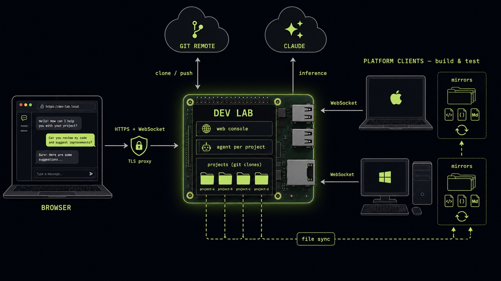

<a href="https://claude.ai"></a>

# claude-agent-team



An always-on autonomous development lab: a Claude Agent SDK client that runs
uninterrupted on any always-on host, does real dev work on git repos, is
steered from a browser (per-project chat), and borrows capabilities it lacks
(e.g. building and testing on macOS) from platform clients that dial in from
other machines.

The lab runs anywhere Python 3.11+ and the Claude Code CLI run — a Linux
server, a Mac mini in a closet, a VPS, or a Raspberry Pi (the reference
deployment is a Pi 5 behind an Apache TLS proxy, but nothing depends on it).

- **Plan & status:** [`project-plan.md`](project-plan.md) — goal, milestones, decisions, current state.
- **Architecture & docs:** [`CLAUDE.md`](CLAUDE.md) — orientation + a card index.
- **Run it:** [`QUICKSTART.md`](QUICKSTART.md) — local use and production deployment.

## Repository layout

```
dev-lab/                      # the lab: web console + agent loop (runs on the lab host)
  src/dev_lab/
    web.py                    #   FastAPI console: login, projects, chat WS, client WS
    projects.py               #   ProjectManager: clone/init, repo actions, uploads
    clients.py                #   ClientRegistry + the client wire protocol (doc in module)
    agent.py                  #   Claude Agent SDK loop + mcp__lab toolset
    session.py / workspace.py #   chat branches / git wrapper
    db.py / auth.py           #   SQLite migrations / users + invites
    static/                   #   no-build vanilla JS frontend
chat-client/                  # CLI control surface (older, single-project; secondary)
extensions/
  platform-client/            # platform-client runtime + manifest sync (pip-installable)
deploy/                       # systemd templates + Apache/nginx proxy configs + site dirs
cards/                        # Context Cards (see CLAUDE.md for the index)
```

Each component is independently deployable with its **own venv** and its own
`pyproject.toml` (see `cards/python-venvs.md`).

## Quickstart

Requires Python 3.11+, git, and `make`.

```sh
make setup    # create a venv per component, install editable + dev deps
make test     # run pytest in every component
make lint     # ruff check
make fmt      # ruff format
```

To set up a single component, use its `setup.<name>` target — `make
setup.dev-lab`, `make setup.chat-client`, or `make setup.platform-client`.

Run the web console and connect a capability machine:

```sh
dev-lab/.venv/bin/dev-lab web --labs-dir ~/labs --host 127.0.0.1 --port 8770
# on the machine with the capability (build, test, …):
platform-client connect --lab ws://<lab-host>:8770/ws/client --name mac \
  --capability run_tests --capability build
```

See [`QUICKSTART.md`](QUICKSTART.md) for the full walkthrough, and `deploy/`
for production setup (systemd service template + Apache or nginx TLS
reverse-proxy configs; `deploy/home/` is a complete worked example).

## Authentication — the `claude` CLI, no API key

All Claude auth is handled by a **one-time `claude` login** on the lab host
(Claude subscription). The Agent SDK reads the stored credentials from
`~/.claude`; they auto-refresh and survive restarts. There is **no API key
anywhere** — not in `.env`, not in the environment:

```sh
claude        # complete login once (SSH: press `c` to copy the URL, paste the code back)
```

Do **not** set `ANTHROPIC_API_KEY` / `ANTHROPIC_AUTH_TOKEN` — they would
override subscription auth and bill the API, so the lab refuses to start if
either is present. See `cards/subscription-auth.md`.

Everything else is per-feature, not global:

- **GitHub** — per project: paste a token when adding a private repo in the web
  console (public repos need none). No global `GITHUB_TOKEN`.
- **Platform clients** — optionally set `CLIENT_TOKEN` on the lab and pass the
  same to `platform-client connect` (open on a trusted LAN otherwise).
- `dev-lab/.env` carries optional overrides only (`MODEL`, `CLIENT_TOKEN`) —
  never a credential for Claude.

## Status

The lab is live (reference deployment: a Raspberry Pi 5 behind Apache TLS).
The web console covers multi-user login with strict per-user project lists,
projects (clone a URL or git-init a blank repo), per-project chat with a
resumed agent session, model selection, and agent setup (project prompt, MCP
servers, repo-managed skills), repo actions (fetch / pull / push / reset /
rebase-on-base / merge / download-zip / remove project), a file browser that
can also browse connected clients' mirrors, and uploads (into the repo, or as
chat attachments for the agent to look at). Platform clients dial the lab
over WebSocket, sync the working tree via content-hash manifests into
per-lab-namespaced mirrors, run builds/tests there, and report results +
changed files; the agent drives them through `mcp__lab` (`list_clients` /
`run_on_client` / `fetch_from_client`). See `project-plan.md` for milestones
and what's still open.
