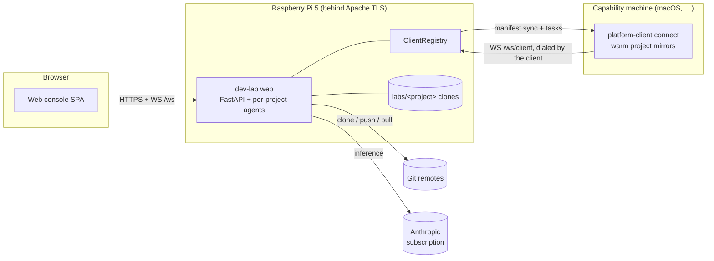

# architecture

How the web console, the lab, and platform clients fit together and how work flows between them.

## Components

- **Dev lab** — a long-running Python process on the Raspberry Pi 5: the
  FastAPI **web console** (login, projects, chat) plus a Claude Agent SDK loop
  per project. Each project is its own git clone under `labs/` with its own
  agent context and branch. The lab is the only component that talks to
  Anthropic (subscription auth via the `claude` login).
- **Browser** — the primary control surface: per-project chat (streamed agent
  output, markdown + mermaid), repo actions, file browser, uploads, admin.
- **Platform clients** — processes on other machines (e.g. a macOS box) that
  **dial in to the lab** over WebSocket and announce capabilities the Pi lacks
  (build, test, platform tooling). The agent drives them through lab-local
  `mcp__lab` tools; code reaches them via content-hash **manifest sync** of the
  project's working tree into a warm per-project mirror.
- **Git remotes (e.g. GitHub)** — source of truth for landing work: the lab
  clones, commits on chat branches, merges/rebases, and pushes. Not the code
  transport to platform clients (manifest sync is, so uncommitted work is
  testable).
- **Chat client (CLI)** — the older single-project surface
  (`dev-lab serve` + `chat-client`), still functional, secondary.

## Topology

## The three flows

1. **Control flow** — browser → lab: instructions in, agent output and tool
   activity streamed back over the console WebSocket; repo actions over REST.
2. **Capability flow** — the agent calls `mcp__lab` tools
   (`list_clients` / `run_on_client` / `fetch_from_client`); the registry
   dispatches over the client's WebSocket; the client syncs the mirror, runs
   the command, reports result + changed files; artifacts can be fetched back
   into the lab tree.
3. **Code flow** — the lab works in the project's local clone on `chat/<ts>`
   branches; landing work is merge/rebase + push to the remote. Platform
   clients never touch the remote — they receive the exact working tree
   (uncommitted changes included) via manifest sync.

## Why this shape

Inference and orchestration stay on owned hardware (uninterrupted operation,
local compute). Capabilities the Pi can't provide are borrowed from machines
that have them — and those machines dial the lab because they are NAT-ed
laptops while the Pi is the one stable address (reachability, discovery, and
presence for free). Manifest sync decouples "test this" from "commit this", so
mid-session states are testable; the git remote stays the source of truth for
finished work.
