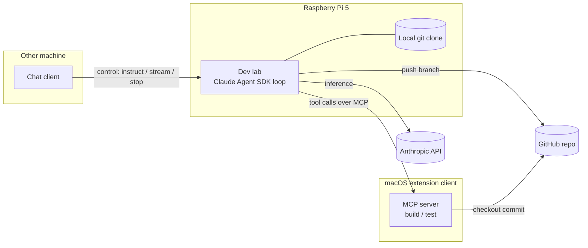

# architecture

How the lab, chat client, and extension clients fit together and how work flows between them.

## Components

- **Dev lab** — a long-running Python process on the Raspberry Pi 5 hosting a
  Claude Agent SDK loop. It owns a local clone of the GitHub repo, makes changes,
  commits, and pushes. It is the only component that talks to the Anthropic API.
- **Chat client** — a thin client (on any machine) that connects to the lab's
  control surface to start/steer the agent and stream its output.
- **Extension clients** — processes on other machines (e.g. a macOS box) that
  run MCP servers exposing capabilities the Pi lacks: building, running tests,
  platform-specific tooling. The lab's agent calls them as tools.
- **GitHub repo** — source of truth and the substrate that synchronizes code
  between the lab and the extension clients.

## Topology

## The three flows

1. **Control flow** — chat client → lab: instructions in, agent output streamed
   back, start/stop/steer.
2. **Capability flow** — agent on the Pi calls an MCP tool → an extension client
   executes it (e.g. `run_tests` on macOS) → result returns to the agent.
3. **Code flow** — the lab works in its local clone and pushes a branch to
   GitHub; extension clients check out that exact commit to build and test it.
   Git is how work made on the Pi reaches the macOS builder.

## Why this shape

Inference and orchestration stay on owned hardware (uninterrupted operation,
local compute). Capabilities the Pi can't provide are borrowed over MCP rather
than reimplemented. GitHub decouples "where code is written" from "where it is
built", so the lab and any number of extension clients converge on commits.
