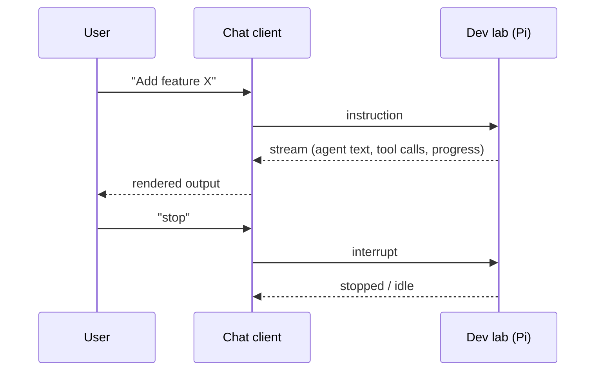

# chat-client

The control surface: how a human starts, steers, and observes the lab from another machine.

## Responsibility

- Connect to the dev lab and send instructions (new task, follow-up, "stop").
- Stream the agent's output (messages, tool calls, progress) back to the user in
  real time.
- Start and stop agent runs; surface lab status (idle / working / error).

## Interaction

## Key concerns

- **Transport is undecided** — candidates: WebSocket, HTTP + SSE, or an MCP
  server on the lab side that the client drives. (Open question in the plan.)
- **Streaming** — the value of the client is live visibility into a long-running
  autonomous run, so partial/streamed output is a first-class requirement.
- **Steering** — must be able to interrupt and redirect, not just fire-and-forget.
- **Auth** — the client may live off the Pi's LAN; the connection needs
  authentication (open question in the plan).

## Not covered here

The agent loop itself, and where the client physically runs / how it reaches the
Pi, live in their own domains — route via the index in CLAUDE.md.
