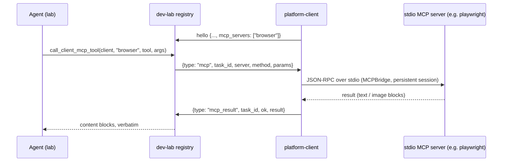

# client-mcp-servers

Tunneled MCP: a platform client runs local stdio MCP servers (a browser, platform tooling) and the lab's agents call their tools over the client's own dialed-in socket.

## Responsibility

- Let a client machine offer **interactive, stateful tools** — not just "run a
  command in the mirror" — e.g. Playwright's browser MCP: navigate, inspect
  the DOM (accessibility snapshots), click, screenshot.
- Keep the **reversed connection**: the client dials the lab; MCP requests are
  tunneled back over that socket. No lab→client connectivity, no VPN.
- Pass tool results through **verbatim**, including image content blocks — the
  agent literally sees screenshots.

## Shape



## How to use it

```sh
platform-client connect --lab wss://<host>/dev-lab/ws/client --name mac-browser \
  --token <CLIENT_TOKEN> --mcp browser="npx @playwright/mcp@latest"
```

`--mcp NAME=COMMAND` is repeatable — any stdio MCP server works. The agent
discovers servers via `list_clients` (the registry includes `mcp_servers`),
lists tools with `list_client_mcp_tools(client, server)`, and invokes them
with `call_client_mcp_tool(client, server, tool, arguments)`.

## Key concerns

- **Lifecycle = the client process.** `MCPBridge` (platform_client/runtime.py)
  spawns the server subprocess lazily on first request and keeps the MCP
  session open until the client exits — so state (a loaded page, a logged-in
  session) **persists across tool calls**. No auto-restart: a dead server
  fails fast with a readable error; restart the platform client to recover.
- **Concurrency** — MCP calls are served off the client's receive loop
  (fire-and-forget tasks; the websocket send is lock-serialized), so a slow
  page load doesn't block manifest sync or test runs. Requests to one server
  are serialized through its bridge queue.
- **Only `tools/list` and `tools/call` are tunneled** (v1) — no resources,
  prompts, or notifications. The lab-side timeout is 120s per call.
- **Images reach the user, not just the agent.** Image blocks in a result
  (screenshots) are auto-saved into the project's `.lab-uploads/` (chat
  scratch: out of commits/mirrors, deleted on clear chat), rendered inline in
  the console transcript via a `tool_image` event, and the agent is handed
  the path with a hint to embed it (``) so it survives a
  reload. Note: Playwright MCP must be allowed to *return* images
  (`--image-responses=allow` if your version defaults them off) — a
  text-only "saved to <client path>" result can't be rescued lab-side.
- **Trust model unchanged** — `CLIENT_TOKEN` gates who may connect; the client
  owner chooses which servers to offer. Like capabilities, the announced
  names are advisory; the lab refuses calls to *unannounced* names but does
  not sandbox the server itself.
- **vs. the agent tab's MCP servers** (cards/web-console.md): those run on or
  are dialed from the **lab host** and are configured per project; these run
  on a **client machine** and follow the client's connection. Use the agent
  tab for things the lab can reach; use the tunnel when the tool must run on
  the client (a macOS browser, Xcode tooling) or the client is NAT-ed.

## Not covered here

The base client model — presence, manifest sync, run/fetch, mirrors — is
cards/extension-clients.md; why MCP sits at the agent boundary at all is
cards/mcp-for-extensions.md.
