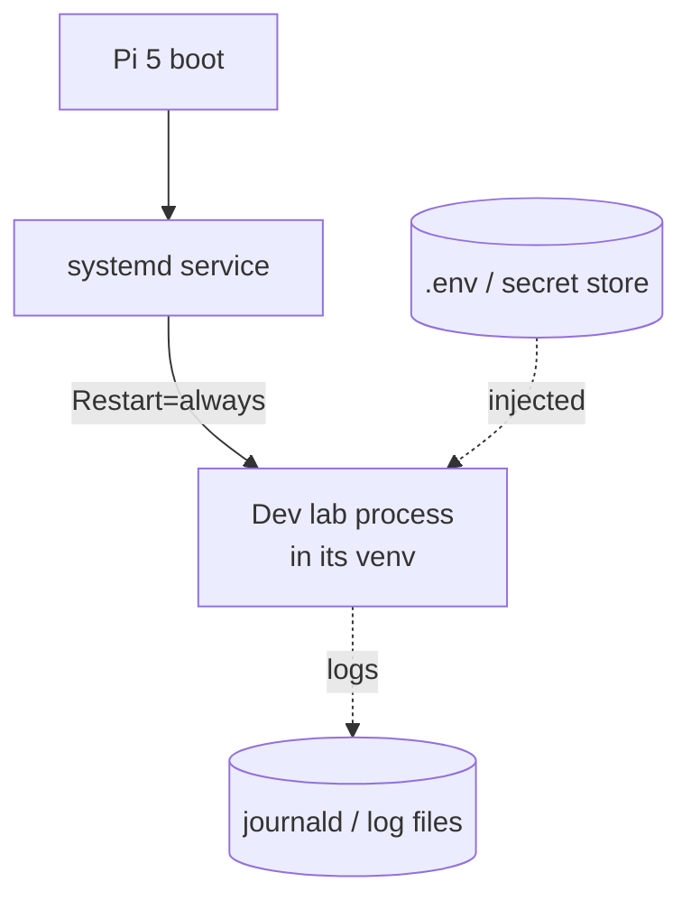

# deployment

Running the lab unattended on a Raspberry Pi 5 — process supervision, venvs, secrets, restarts.

## Responsibility

- Keep the dev lab running uninterrupted: start on boot, restart on crash.
- Manage Python environments per component with venvs.
- Provide credentials to the lab: a one-time `claude` login (Claude
  subscription) plus a GitHub token in a gitignored `.env`.

## Shape

## Key concerns

- **Supervision** — a `systemd` unit with restart-on-failure and start-on-boot is
  the baseline for "runs uninterrupted." Logs to journald for observability.
- **Per-component venvs** — the lab, and any co-located tooling, each get their
  own venv (a settled toolchain decision; see the index in CLAUDE.md).
- **Credentials** — the Claude subscription is authenticated by a one-time
  `claude` login; credentials persist in `~/.claude` and Claude Code keeps them
  refreshed, so they survive restarts without re-login (a settled auth decision;
  see the index in CLAUDE.md). Only the GitHub token goes in the gitignored
  `.env`. Ensure `ANTHROPIC_API_KEY` is **not** set in the service environment —
  it would override subscription auth.
- **Service user** — credentials are user-scoped in `~/.claude`, so the service
  must run as the user who ran `claude` login, or set `CLAUDE_CONFIG_DIR` to that
  user's config dir.
- **Session persistence** — for long tasks to survive restarts, session/context
  state must be stored on disk (open question in the plan).
- **Resource limits** — the Pi is small; mind memory/CPU for the agent process
  and avoid heavy local builds (those go to extension clients).

## Extension-client hosts

Extension clients run on their own machines (e.g. macOS) and are supervised
there independently; this card covers the Pi lab host specifically.

## Not covered here

What the lab actually does, and reaching the lab from off-LAN, live in their own
entries — route via the index in CLAUDE.md.
