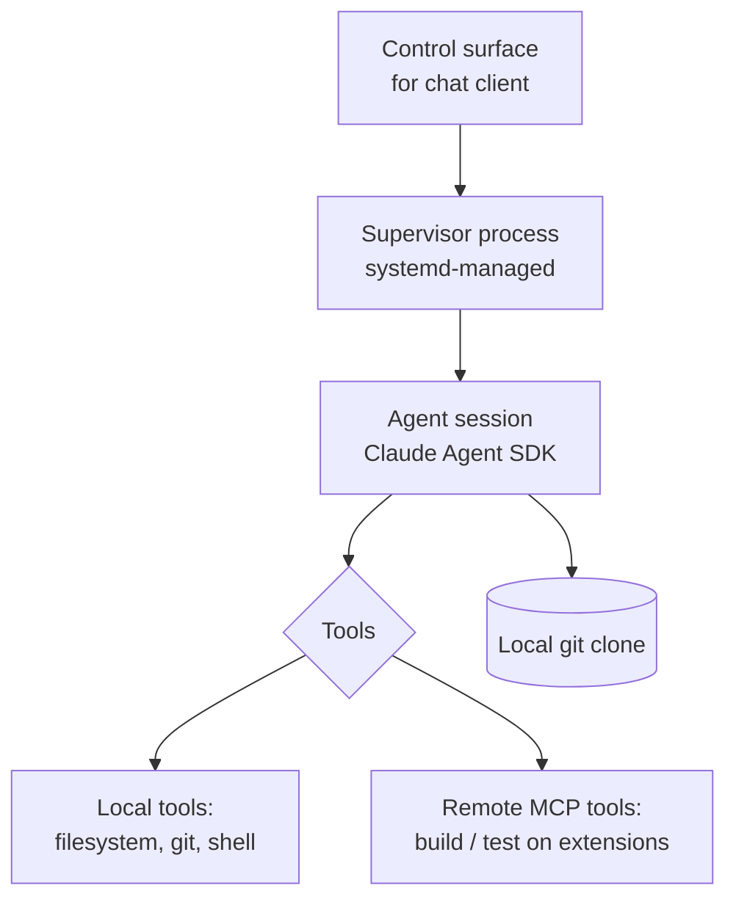

# dev-lab

The autonomous core: a Claude Agent SDK loop running uninterrupted on the Pi 5, working in a local git clone.

## Responsibility

- Run the agent loop using the self-hosted Claude Agent SDK for Python.
- Hold a local clone of the target GitHub repo and do the actual edits there.
- Be the only component that authenticates to Anthropic, using the **Claude
  subscription** via a one-time `claude` login (not an API key; model
  `claude-opus-4-8`, adaptive thinking).
- Connect outward to extension clients' MCP servers and expose them to the agent
  as tools.
- Accept instructions from, and stream output to, the chat client via the
  control surface.

## Shape

## Key concerns

- **Uninterrupted operation** is the headline requirement — the supervisor must
  survive crashes (restart-on-failure) and Pi reboots (a deployment concern).
- **Session persistence** — agent session/context should survive restarts so a
  long-running task isn't lost. (Open question in the plan.)
- **Safety of autonomy** — the agent commits and pushes on its own; keep work on
  branches, never force-push shared history, and gate destructive/outward actions.
- **Local vs remote tools** — filesystem/git/shell run locally on the Pi; build
  and test are remote MCP tools because the Pi isn't the target build platform.

## Not covered here

The chat-client control protocol, how extension capabilities are built, git/
branch conventions, and systemd/venv/secrets each live in their own domain —
route via the index in CLAUDE.md.
