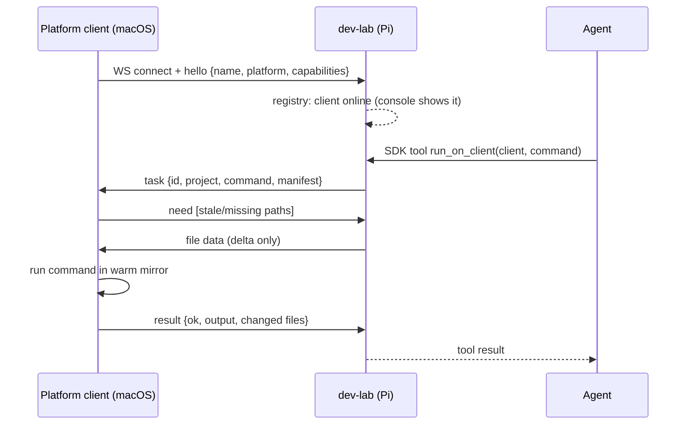

# extension-clients

**Platform clients** — capability providers on other machines that **dial in to the lab** over WebSocket, announce what they can do, and run commands in a synced mirror of a project's working tree. (Settled name: *platform client*; the directory is still `extensions/`.)

## Responsibility

- Connect outbound to the lab's web app (`/ws/client`), authenticate (optional
  shared `CLIENT_TOKEN`), and announce `{name, platform, capabilities}`.
- Stay connected: **presence is the registry** — the console and the agent see
  exactly the clients that are online now.
- Maintain a **per-project mirror** of the lab's working tree via manifest
  sync, so the *uncommitted* mid-session state is testable without a GitHub
  round-trip.
- Execute dispatched commands in the mirror and report
  `{ok, returncode, stdout, stderr}` **plus the files the run changed**.

## Flow

## Key pieces

- **Reversed connection** — clients are NAT-ed laptops that roam and sleep; the
  Pi is the one stable address. Outbound-only from clients means no inbound
  ports or per-client auth surface. The wire is a lab-owned JSON protocol over
  WebSocket (see `platform_client/runtime.py` and `dev_lab/clients.py`).
- **MCP stays at the agent boundary** — the agent sees `list_clients` /
  `run_on_client` as lab-local SDK tools; it never speaks to clients directly.
- **Manifest sync, not git** — the lab sends a content-hash manifest of the
  project tree (default ignores: `.git`, `.venv`, `__pycache__`, …); the client
  requests only changed files, deletes ones that vanished, and keeps the mirror
  warm between runs. Identity of "what ran" is the manifest hash, not a sha.
- **Changed-files report** — the client snapshots its mirror manifest before a
  run and diffs after, so generated/modified files are visible per run.
- **Shared scaffold** — `extensions/platform-client` (package
  `platform_client`) owns manifest sync, the runtime, and the
  `platform-client connect --lab <url>` CLI. A new client is configuration
  (name + capabilities) more than code.

## History

v1 (M4, superseded 2026-06-10): clients were FastMCP servers over HTTP+SSE the
lab dialed via `EXTENSIONS=name=url`; code transport was a fresh git clone per
call. Reversed because reachability, discovery, and mid-session testability all
pushed the same way. `extensions/macos-build-test` is the old-model reference
until it's ported.

## Not covered here

The MCP rationale (cards/mcp-for-extensions.md), branch/commit conventions
(cards/repo-sync.md), and the agent loop (cards/dev-lab.md).
