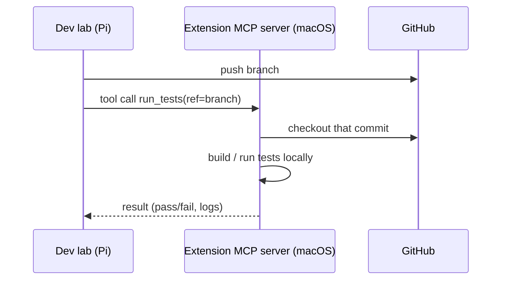

# extension-clients

Capability providers on other machines — MCP servers that give the Pi powers it lacks, like building and testing on macOS.

## Responsibility

- Run an MCP server on a machine that has a capability the Pi doesn't (e.g. a
  macOS host for macOS builds/tests, or any platform-specific toolchain).
- Expose that capability as MCP tools (e.g. `build`, `run_tests`,
  `lint_platform`) the lab's agent can call.
- Operate on the same code the lab produced by checking out the relevant commit
  from GitHub (a code-synchronization concern).

## Flow

## Key concerns

- **MCP is the contract** — each capability is a tool with a typed schema; the
  lab consumes it like any other tool. Lets us add machines without changing the
  lab's core. Transport is **HTTP+SSE** (a settled transport decision; see the
  index in CLAUDE.md).
- **Code reaches extensions via git**, not file transfer — the extension checks
  out the commit the lab pushed.
- **Discovery/registration** is undecided — static config vs a registry (open
  question in the plan).
- **Reachability and auth** — extensions may be off the Pi's LAN; transport and
  auth (e.g. VPN/Tailscale) are open questions in the plan.
- Multiple extension clients are expected (different platforms/capabilities).

## Not covered here

The rationale for choosing MCP, branch/commit conventions, and the agent that
calls these tools live in their own entries — route via the index in CLAUDE.md.
