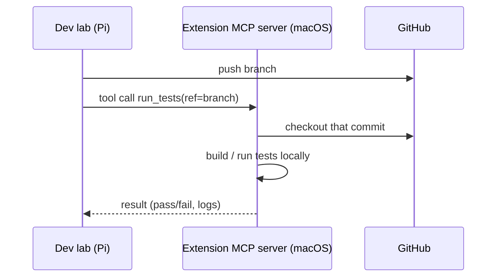

# extension-clients

Capability providers on other machines — MCP servers that give the Pi powers it lacks, like building and testing on macOS. Working name for one of these: a **platform client** (terminology still settling; "extension" survives in the env var and directory name).

## Responsibility

- Run an MCP server on a machine that has a capability the Pi doesn't (e.g. a
  macOS host for macOS builds/tests, or any platform-specific toolchain).
- Expose that capability as MCP tools the lab's agent can call.
- Operate on the same code the lab produced by checking out the relevant commit
  from GitHub (a code-synchronization concern).

The first implementation, `extensions/macos-build-test`, is a FastMCP server
(`macos-build-test serve --host --port`) exposing `run_tests` and `build` —
each clones a repo, checks out a ref, runs a command, and returns
`{ok, returncode, stdout, stderr}`. The lab is pointed at extensions via its
`EXTENSIONS=name=url` env (the agent gets each as an `mcp__<name>` toolset).

## Creating a new platform client

The capability-independent parts live in the shared scaffold
`extensions/platform-client` (package `platform_client`):

- `run_in_checkout(repo, ref, command)` / `CommandResult` — clone a git ref
  into a throwaway workspace, run a command there, return a bounded result.
- `extension_cli(name, build_server, default_port=…)` — the standard
  `<name> serve --host --port` entry point (SSE transport).

A new client is a sibling package under `extensions/` with three small files:
a `build_server(*, host, port) -> FastMCP` that registers its capability tools
(that's the whole capability layer — write the tool docstrings carefully, they
are the agent-facing contract), a one-line `__main__.py` via `extension_cli`,
and a `pyproject.toml` depending on `mcp`. Then:

1. add the package to `COMPONENTS` in the root `Makefile`, plus a
   `pip install -e ../platform-client` line under `setup` (relative-path deps
   aren't expressible in a pyproject);
2. pick a unique default port (macos-build-test owns 8970);
3. point the lab at it via `EXTENSIONS=name=url`.

`extensions/macos-build-test` is the reference: after the scaffold extraction
it is only its two tool definitions.

## Flow

## Key concerns

- **MCP is the contract** — each capability is a tool with a typed schema; the
  lab consumes it like any other tool. Lets us add machines without changing the
  lab's core. Transport is **HTTP+SSE** (a settled transport decision; see the
  index in CLAUDE.md).
- **Code reaches extensions via git**, not file transfer — the extension checks
  out the commit the lab pushed.
- **Discovery/registration** is undecided — static config vs a registry (open
  question in the plan).
- **Reachability and auth** — extensions may be off the Pi's LAN; transport and
  auth (e.g. VPN/Tailscale) are open questions in the plan.
- Multiple extension clients are expected (different platforms/capabilities).

## Not covered here

The rationale for choosing MCP, branch/commit conventions, and the agent that
calls these tools live in their own entries — route via the index in CLAUDE.md.
