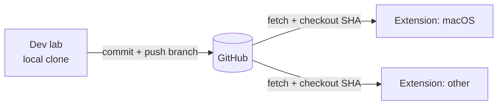

# repo-sync

GitHub as both source of truth and the substrate that moves code between the lab and extension clients.

## Responsibility

- Hold the canonical repository on GitHub.
- Let the lab work in a local clone, commit, and push branches.
- Let extension clients fetch the exact commit the lab produced so they build and
  test the same code.

## Why git is the substrate

The lab writes code on the Pi; the macOS extension builds it. Rather than stream
files between machines, both converge on commits: the lab pushes, the extension
checks out. A commit SHA is an unambiguous "build exactly this" handle.

## Key concerns

- **Work on branches** — the autonomous agent should never force-push shared
  history; isolate work so it's reviewable and reversible.
- **Pass the commit SHA, not "latest"** — when the lab asks an extension to
  build/test, it should reference the precise ref it pushed to avoid races.
- **Credentials** — GitHub auth is **per project**: each project carries its own
  token (entered in the web console, stored on its `projects` row and injected
  into that clone's `origin`), used to clone and push private repos; public repos
  need none. There is no global `GITHUB_TOKEN`. Extensions need read access to
  fetch. Secret handling is a deployment concern.
- **Caching** — extensions can keep a warm clone and fetch incrementally rather
  than re-cloning each run.

## Not covered here

Token storage on the Pi, and how extensions are invoked, live in their own
entries — route via the index in CLAUDE.md.
