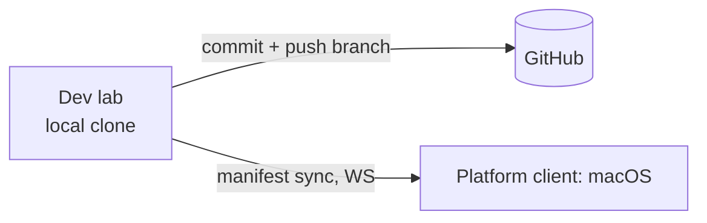

# repo-sync

GitHub as the source of truth for the lab's projects: clone, branch, land, push. *(Amended 2026-06-10: GitHub is no longer the code-transport to platform clients — they receive the working tree via manifest sync over their lab connection, so uncommitted state is testable. See cards/extension-clients.md.)*

## Responsibility

- Hold the canonical repository on GitHub.
- Let the lab work in a local clone, commit, and push branches.

## Why git is the substrate (for landing work)

The lab works on branches in a local clone and converges with the world through
commits: reviewable, reversible, unambiguous. For *moving code to platform
clients* this was originally also the transport (push → client checks out the
SHA); that path is now manifest sync because the thing worth testing
mid-session is the uncommitted tree, and a GitHub round-trip per test run was
pure overhead.

## Key concerns

- **Work on branches** — the autonomous agent should never force-push shared
  history; isolate work so it's reviewable and reversible.
- **Credentials** — GitHub auth is **per project**: each project carries its own
  token (entered in the web console, stored on its `projects` row and injected
  into that clone's `origin`), used to clone and push private repos; public repos
  need none. There is no global `GITHUB_TOKEN`. Platform clients no longer need
  GitHub access at all — code reaches them via manifest sync from the lab.

## Not covered here

Token storage on the Pi, and how extensions are invoked, live in their own
entries — route via the index in CLAUDE.md.
