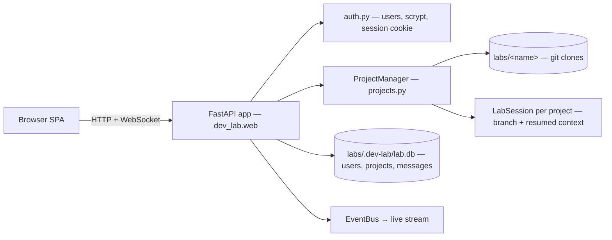

# web-console

The v2 primary surface: a multi-project web app — log in, pick a project, chat with its agent in the browser.

## Responsibility

- Serve a browser UI (login + project sidebar + chat) and authenticate users.
- Manage the `labs/` directory of projects (one git clone each) and expose each as
  its own Claude agent/context.
- Stream live activity (agent text + tool calls + turn lifecycle) over WebSocket
  and persist each project's conversation.

## Shape



Run it: `dev-lab web --labs-dir ~/labs --host --port` (default port 8770).

## Key concerns

- **Multi-project = isolation.** Each project is its own clone → its own cwd →
  its own Claude session and branch. Concurrent chat across projects is fine;
  turns within a project serialize on a per-project lock.
- **Model per project.** Picked in the new-project form (`GET /api/models` lists
  the choices + lab default) and switchable mid-chat from the header dropdown
  (`POST /api/projects/{id}/model`) — the lab's `/model`. Stored on the project
  row (NULL = lab default); the switch drops the cached session so the next turn
  rebuilds with the new model while the resumed conversation continues.
- **Landing work.** A chat commits to its `chat/<ts>` branch; **merge → base**
  (the header button / `POST /api/projects/{id}/merge`) merges that branch into
  the project's default branch (`main`/`master`) locally, aborting on conflict,
  and restores the chat branch so the session can continue. Pushing the result to
  the remote is not wired yet (see the plan's open questions).
- **Refreshing the branch.** **rebase on base** (`POST /api/projects/{id}/rebase`)
  replays the chat branch's commits on top of base's latest, keeping the branch
  linear (it replaced a short-lived merge-base→branch action, 2026-06-10). On
  conflict the rebase is aborted — the branch is untouched — and the response
  carries `status: "conflicts"` + the conflicted paths; the UI then offers to
  hand the whole job to the project's agent as a chat message ("rebase and
  resolve …"), which is the conflict-resolution path. The working tree is left
  on the chat branch either way.
- **Uploads.** Two distinct flows. **Into the repo**: *upload files* in the file
  browser's lab tab (`POST …/upload`, multipart + a `dest` dir field) writes
  into the working tree and **commits immediately** — a dangling uncommitted
  upload would block the next chat session (`LabSession` refuses a dirty tree).
  **For the chat**: the `+` button (or pasting a file/screenshot into the input)
  uploads to `.lab-uploads/` in the clone (`POST …/chat-upload`), shows pending
  chips, and the sent message lists the relative paths for the agent to read.
  `.lab-uploads/` is excluded from commits via `.git/info/exclude` (local-only),
  from client mirrors via manifest `DEFAULT_IGNORES`, and survives **reset**
  (clean runs without `-x`). Both endpoints cap files at 25 MB.
- **Removing a project.** *remove project* (repo tab's danger zone,
  confirm-gated; `DELETE /api/projects/{id}`) deletes the lab's clone and chat
  history and asks every **connected** client to clean its mirror of the
  project (idempotent; per-client failures are reported, an offline client
  keeps its mirror until cleaned another way). The remote repository is never
  touched.
- **Repair & download.** **reset** (`POST …/reset`, confirm-gated) discards all
  uncommitted changes and untracked files in the working tree (ignored files and
  commits survive) — the cleanup for a tree left dirty by a crashed run.
  **download zip** (`GET …/archive`) streams the working tree as a zip
  (`Content-Disposition` attachment), excluding the manifest-sync ignores
  (`.git`, `.venv`, `__pycache__`, …) so the download matches what the file
  browser shows.
- **Auth** — multi-user accounts (username + password, scrypt-hashed); a signed
  session cookie (Starlette `SessionMiddleware`, secret in `<labs>/.dev-lab/secret`).
  The `/ws` endpoint is gated by the same cookie.
- **Access model** — the **first registered user is the super-user** (no invite);
  every later registration must redeem an invite code the super-user mints
  (`POST /api/admin/invites`). Super-users manage the user db via `/api/admin/*`:
  list users, block/unblock, reset password, delete (can't block/delete
  themselves). A super-user can't lock themselves out. Blocked users fail login
  and have any live session rejected. The ⚙ admin panel (sidebar, super-only)
  drives all of this. Migration #5 adds `users.is_super`/`users.blocked` + the
  `invites` table and retroactively promotes the earliest existing user to super.
- **Projects** — auto-discovered from existing checkouts in `labs/`, or created by
  cloning a git URL. GitHub auth is **per project**: a token entered on create
  (or later via the project's token control) is stored on the project row and
  injected into its `origin` for private clone/push/pull; public repos need none.
  Names are single dir segments. The same form starts a **blank project**: leave
  the URL empty and give just a name (regex-gated, `_NAME_RE` in projects.py) —
  the lab `git init -b main`s a fresh repo under `labs/<name>` with a seed
  README commit (sessions need a HEAD to cut branches from) and no remote; a
  taken name is an error, not a `_2` suffix, because the name was chosen
  explicitly.
- **Inspecting work.** Each committed turn shows a **view-diff** button (the
  commit chip) that opens `GET /api/projects/{id}/commits/{sha}/diff` in a modal
  (`diff.js` renders the unified patch as collapsible per-file blocks). A
  **browse files** header button opens a read-only repo browser backed by
  `GET …/tree?path=` (lazy, one dir level) and `GET …/file?path=` (text/markdown,
  binary + 512 KB guards; `.git` hidden, path-traversal refused). Image files
  (png/jpg/gif/webp/svg/…) render inline as `` instead of the "binary file"
  placeholder, and markdown files get their relative image references
  (``, repo-root `/x.png`, `../x.png`) rewritten to resolve against
  the file's directory. Raw bytes are streamed by `GET …/raw?path=` (same
  path-traversal + `.git` guards, media type from the filename) — used both for
  inline image files and for markdown's resolved image src. It shows the
  **working tree** (what's actually checked out), and `…/tree` annotates each
  entry with its **status vs the base branch** (`new`/`modified`, dirs flagged if
  they contain changes) plus the current `branch`, the `base`, and `missing` —
  the count of files that exist on base but not in the checkout. So a project
  parked on a stale `chat/<ts>` branch (cut before later files were merged into
  base) shows its real, short listing *with* a "N files on base not in this
  checkout" hint, instead of silently looking complete. (Earlier this read the
  raw working tree with no annotation, so a stale-branch checkout looked like the
  whole repo and the divergence was invisible even after pull/push/merge.)
- **Browsing client mirrors.** The files dialog grows **source tabs** when any
  connected platform client holds a mirror of the project (`GET …/clients`
  probes each connected client). Selecting a client tab lists its mirror —
  run artifacts included — via `GET …/clients/{name}/mirror` (flat path list;
  the UI nests it; no statuses, it's not a git tree) with file view / raw
  bytes via `…/clients/{name}/file|raw?path=`. A **fetch → lab** button on a
  viewed file copies it into the lab's working tree (`POST
  …/clients/{name}/fetch {paths}` — the web twin of the agent's
  `fetch_from_client` tool; it lands in the tree, so it commits with the
  session unless .gitignored). A **remove mirror** button (confirm dialog)
  deletes the project's files from the client machine (`POST
  …/clients/{name}/clean`); the client stays connected and re-syncs on its
  next run.
- **Rendering** — assistant output is untrusted markdown → `marked` →
  **`DOMPurify.sanitize`** → mermaid (`securityLevel: "strict"`) for ```mermaid
  blocks. Frontend libs are vendored under `static/vendor/` (no build, offline-ok).
- **Syntax highlighting (pretty print)** — common source files in the repo
  browser, plus fenced code blocks in chat/markdown, are highlighted with
  **highlight.js** (vendored `static/vendor/highlight.min.js`, ~36 languages).
  `langForFilename` in `app.js` maps a filename (extension + a few basenames like
  `Dockerfile`/`Makefile`) to a language; `highlightInto` highlights into a
  `<code class="hljs">` and falls back to auto-detect, then to plain text, so a
  miss never blanks the viewer. hljs emits its own escaped span markup (safe to
  set via `innerHTML`). The theme is a small in-house `.hljs-*` ruleset in
  `style.css` keyed to the control-room palette (no separate theme file).
- **State** — all lab state lives under `<labs>/.dev-lab/` (SQLite db + cookie
  secret), out of any project repo.

## Not covered here

The agent loop, the per-project session/branch model, and the extension MCP
servers live in their own entries — route via the index in CLAUDE.md. The CLI
`serve`/`chat-client`/queue are the older single-project surface, now secondary.
