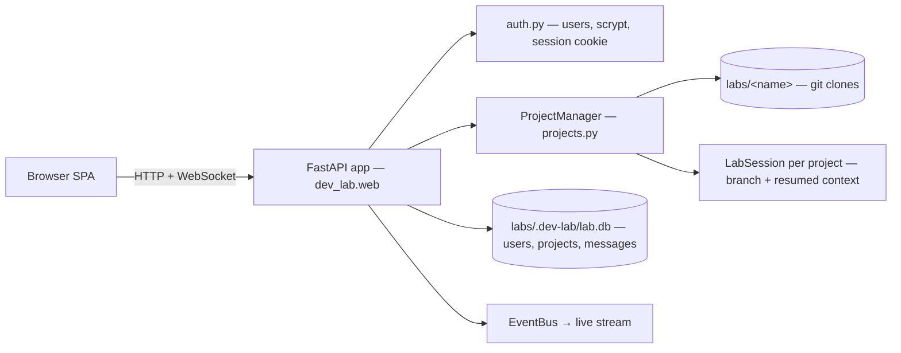

# web-console

The v2 primary surface: a multi-project web app — log in, pick a project, chat with its agent in the browser.

## Responsibility

- Serve a browser UI (login + project sidebar + chat) and authenticate users.
- Manage the `labs/` directory of projects (one git clone each) and expose each as
  its own Claude agent/context.
- Stream live activity (agent text + tool calls + turn lifecycle) over WebSocket
  and persist each project's conversation.

## Shape



Run it: `dev-lab web --labs-dir ~/labs --host --port` (default port 8770).

## Key concerns

- **Multi-project = isolation.** Each project is its own clone → its own cwd →
  its own Claude session and branch. Concurrent chat across projects is fine;
  turns within a project serialize on a per-project lock.
- **Landing work.** A chat commits to its `chat/<ts>` branch; **merge → base**
  (the header button / `POST /api/projects/{id}/merge`) merges that branch into
  the project's default branch (`main`/`master`) locally, aborting on conflict,
  and restores the chat branch so the session can continue. Pushing the result to
  the remote is not wired yet (see the plan's open questions).
- **Refreshing the branch.** The mirror action **merge base → branch**
  (`POST /api/projects/{id}/merge-base`) merges the base branch *into* the chat
  branch — a local "pull into the project branch" so a long-running session keeps
  working on top of base's latest commits. Like merge → base it aborts on
  conflict; it leaves the working tree on the chat branch.
- **Auth** — multi-user accounts (username + password, scrypt-hashed); a signed
  session cookie (Starlette `SessionMiddleware`, secret in `<labs>/.dev-lab/secret`).
  The `/ws` endpoint is gated by the same cookie.
- **Access model** — the **first registered user is the super-user** (no invite);
  every later registration must redeem an invite code the super-user mints
  (`POST /api/admin/invites`). Super-users manage the user db via `/api/admin/*`:
  list users, block/unblock, reset password, delete (can't block/delete
  themselves). A super-user can't lock themselves out. Blocked users fail login
  and have any live session rejected. The ⚙ admin panel (sidebar, super-only)
  drives all of this. Migration #5 adds `users.is_super`/`users.blocked` + the
  `invites` table and retroactively promotes the earliest existing user to super.
- **Projects** — auto-discovered from existing checkouts in `labs/`, or created by
  cloning a git URL. GitHub auth is **per project**: a token entered on create
  (or later via the project's token control) is stored on the project row and
  injected into its `origin` for private clone/push/pull; public repos need none.
  Names are single dir segments.
- **Inspecting work.** Each committed turn shows a **view-diff** button (the
  commit chip) that opens `GET /api/projects/{id}/commits/{sha}/diff` in a modal
  (`diff.js` renders the unified patch as collapsible per-file blocks). A
  **browse files** header button opens a read-only repo browser backed by
  `GET …/tree?path=` (lazy, one dir level) and `GET …/file?path=` (text/markdown,
  binary + 512 KB guards; `.git` hidden, path-traversal refused). Image files
  (png/jpg/gif/webp/svg/…) render inline as `` instead of the "binary file"
  placeholder, and markdown files get their relative image references
  (``, repo-root `/x.png`, `../x.png`) rewritten to resolve against
  the file's directory. Raw bytes are streamed by `GET …/raw?path=` (same
  path-traversal + `.git` guards, media type from the filename) — used both for
  inline image files and for markdown's resolved image src. It shows the
  **working tree** (what's actually checked out), and `…/tree` annotates each
  entry with its **status vs the base branch** (`new`/`modified`, dirs flagged if
  they contain changes) plus the current `branch`, the `base`, and `missing` —
  the count of files that exist on base but not in the checkout. So a project
  parked on a stale `chat/<ts>` branch (cut before later files were merged into
  base) shows its real, short listing *with* a "N files on base not in this
  checkout" hint, instead of silently looking complete. (Earlier this read the
  raw working tree with no annotation, so a stale-branch checkout looked like the
  whole repo and the divergence was invisible even after pull/push/merge.)
- **Rendering** — assistant output is untrusted markdown → `marked` →
  **`DOMPurify.sanitize`** → mermaid (`securityLevel: "strict"`) for ```mermaid
  blocks. Frontend libs are vendored under `static/vendor/` (no build, offline-ok).
- **State** — all lab state lives under `<labs>/.dev-lab/` (SQLite db + cookie
  secret), out of any project repo.

## Not covered here

The agent loop, the per-project session/branch model, and the extension MCP
servers live in their own entries — route via the index in CLAUDE.md. The CLI
`serve`/`chat-client`/queue are the older single-project surface, now secondary.
